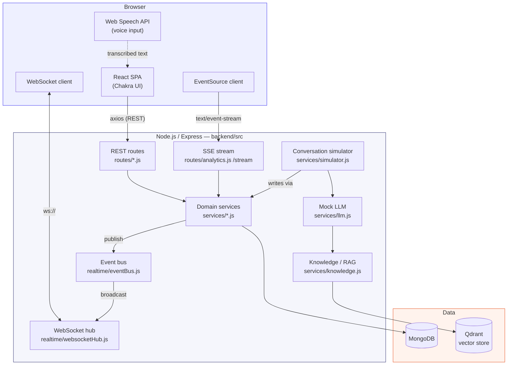
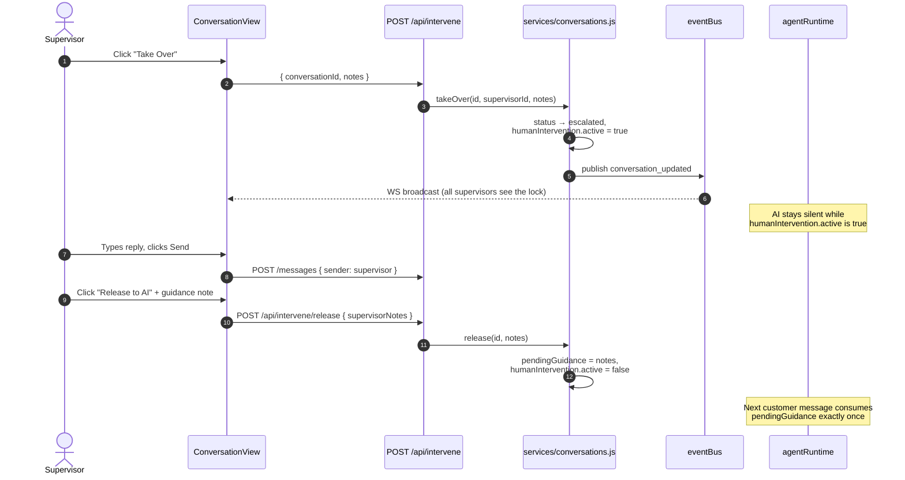
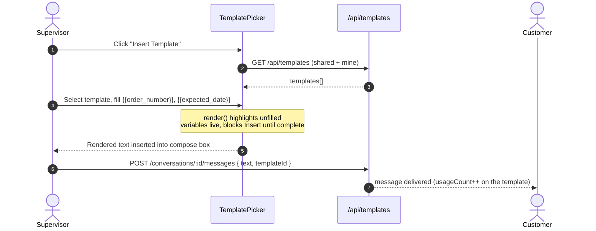

# Zangoh — AI Agent Supervisor Workstation

A workstation that lets human supervisors monitor AI customer-service agents in real time, take over a conversation, hand it back with guidance, tune agent behavior, and manage reusable response templates.

**Stack:** Node/Express + MongoDB + Qdrant (backend) · React + Chakra UI (frontend) · WebSocket + Server-Sent Events (real time) · Docker Compose.

---

## Contents

- [Quick start](#quick-start)
- [Architecture](#architecture)
- [Real-time design](#real-time-design)
- [Key flows](#key-flows)
  - [Take over → release with guidance](#1-take-over--release-with-guidance)
  - [Response templates (mid-session requirement)](#2-response-templates-mid-session-requirement)
  - [Live dashboard metrics (SSE)](#3-live-dashboard-metrics-sse)
- [Project layout](#project-layout)
- [API reference](#api-reference)
- [Testing](#testing)
- [Design decisions & trade-offs](#design-decisions--trade-offs)
- [Challenges faced & solutions](#challenges-faced--solutions)
- [Known limitations](#known-limitations)

---

## Quick start

```bash
git clone <this-repo>
cd supervisor-workstation
docker compose up --build
```

| Service | URL |
|---|---|
| Frontend | http://localhost:3000 |
| Backend API | http://localhost:8080 |
| API docs (Swagger) | http://localhost:8080/api-docs |
| MongoDB | localhost:27017 |
| Qdrant | localhost:6333 |

The database seeds itself automatically on first boot (see [`backend/src/seed`](backend/src/seed)) and a background simulator (see [`backend/src/services/simulator.js`](backend/src/services/simulator.js)) generates live customer traffic so the dashboard is never empty. No API keys are required — the LLM, sentiment analysis and vector search are self-contained mocks (see [Design decisions](#design-decisions--trade-offs)).

### Running without Docker

```bash
# Terminal 1 — Mongo + Qdrant only
docker compose up mongodb qdrant

# Terminal 2 — backend
cd backend && npm install && npm run dev

# Terminal 3 — frontend
cd frontend && npm install && npm start
```

### Tests

```bash
cd backend && npm test        # 22 unit tests: template engine, alert rules, mock LLM
cd testing && npm install && npm test   # the challenge's own end-to-end test-runner
```

---

## Architecture



**Why this shape:** every state change (a message, a takeover, a status change) goes through one [`services/conversations.js`](backend/src/services/conversations.js) module, which persists to Mongo *and* publishes on the [event bus](backend/src/realtime/eventBus.js) in the same call. The [WebSocket hub](backend/src/realtime/websocketHub.js) is a dumb broadcaster subscribed to that bus — routes, the simulator, and the agent runtime never touch WebSocket directly, so there's exactly one place that can get "notify the UI" wrong instead of five.

---

## Real-time design

Two independent real-time channels, each chosen for what it's actually good at:

| Channel | Carries | Why |
|---|---|---|
| **WebSocket** ([`websocketHub.js`](backend/src/realtime/websocketHub.js)) | Conversation/message/agent/template events, high-alert notifications | Bidirectional, event-driven, low-latency — right fit for "a message just arrived" |
| **SSE** ([`/api/analytics/stream`](backend/src/routes/analytics.js)) | Dashboard KPI snapshot, pushed every 2s | One-directional, auto-reconnecting, trivially cacheable per-connection — right fit for "refresh this number on a timer" without hand-rolling reconnect/backoff logic that `EventSource` already gives you for free |

The dashboard ([`hooks/useOverviewStream.js`](frontend/src/hooks/useOverviewStream.js)) fetches one REST snapshot immediately for instant paint, then opens the SSE stream once the page's other initial requests have actually settled — an `EventSource` is a genuinely never-ending HTTP response, so opening it immediately on mount would race the page's own load sequence. It falls back to 5s polling if `EventSource` is unavailable or the stream keeps failing.

```mermaid
sequenceDiagram
    autonumber
    participant FE as Dashboard (React)
    participant BE as /api/analytics/stream
    participant DB as MongoDB

    FE->>BE: GET /api/analytics/overview (instant snapshot)
    BE-->>FE: JSON (paints KPI tiles immediately)
    FE->>BE: GET /api/analytics/stream (EventSource)
    activate BE
    loop every 2s, until client disconnects
        BE->>DB: aggregate conversations/agents
        DB-->>BE: stats
        BE-->>FE: event: overview\ndata: {...}
    end
    deactivate BE
    Note over FE: Connection drops → EventSource<br/>auto-reconnects; 3 failures → poll fallback
```

---

## Key flows

### 1) Take over → release with guidance



A second supervisor attempting to take over a conversation already held by someone else gets a `409 Conflict` (see [`conversations.js#takeOver`](backend/src/services/conversations.js)) — enforced with an atomic `findOneAndUpdate` guard, not a read-then-write race.

### 2) Response templates (mid-session requirement)

This was the challenge's mid-session addition. It's implemented end-to-end: creation, categorization, sharing, and — critically — **usage during an active intervention** with live variable substitution.

- Engine: [`backend/src/services/templateEngine.js`](backend/src/services/templateEngine.js) and its byte-identical mirror [`frontend/src/utils/templateEngine.js`](frontend/src/utils/templateEngine.js) (so the editor's live preview and the server always agree on `{{variable}}` syntax).
- Management screen: [`pages/Templates.js`](frontend/src/pages/Templates.js) — search, category filter, shared/mine tabs.
- Creation/edit modal: [`components/TemplateEditorModal.js`](frontend/src/components/TemplateEditorModal.js) — variables are *derived automatically* from `{{placeholders}}` as you type, never hand-entered.
- Usage-in-conversation modal: [`components/TemplatePicker.js`](frontend/src/components/TemplatePicker.js) — fills variables with a **live, color-coded preview** (green = filled, amber = still `{{needs_a_value}}`) before the text ever reaches the compose box, satisfying "variable substitution should be clearly indicated to users" literally.
- Visibility: a supervisor sees every *shared* template plus their own *private* ones (enforced server-side in [`routes/templates.js`](backend/src/routes/templates.js), not just hidden in the UI — a private template a supervisor can't see returns `404`, not `403`, so its existence isn't leaked either).



### 3) Live dashboard metrics (SSE)

See [Real-time design](#real-time-design) above for the full sequence diagram.

---

## Project layout

```
supervisor-workstation/
├── backend/
│   ├── src/
│   │   ├── models/          Conversation, Agent, ResponseTemplate, ConfigPreset, KnowledgeBase
│   │   ├── routes/          REST + SSE endpoints
│   │   ├── services/        conversations, agentRuntime, llm, knowledge, alerts, sentiment, simulator
│   │   ├── realtime/        eventBus, websocketHub
│   │   ├── seed/            deterministic demo data + live-traffic scenarios
│   │   └── docs/openapi.json
│   └── tests/                22 unit tests (template engine, alert rules, mock LLM)
├── frontend/
│   └── src/
│       ├── pages/            Dashboard, ConversationView, AgentConfig, Templates, Analytics
│       ├── components/       ConversationList, TemplatePicker, CopilotCard, charts, IconRail…
│       ├── context/          AppDataContext (REST+WS cache), WebSocketContext, SupervisorContext
│       └── hooks/             useOverviewStream (SSE), useSpeechToText (Web Speech API)
├── docker/                   Dockerfiles
├── docker-compose.yml
└── testing/                  the challenge's own provided test-runner.js
```

## API reference

Full OpenAPI 3 spec is served at `/api-docs`; source in [`backend/src/docs/openapi.json`](backend/src/docs/openapi.json) (generated by [`backend/scripts/build-openapi.js`](backend/scripts/build-openapi.js)).

## Testing

- `backend/tests/*.test.js` — 22 Jest unit tests over the pure logic (template engine parsing/rendering, alert-level rules, mock-LLM behavior under different agent configs).
- `testing/test-runner.js` — the challenge's own provided API + WebSocket + UI smoke test, unmodified.

## Design decisions & trade-offs

- **Mock LLM, not a real API key.** The challenge explicitly provides a mock LLM as part of the stack; the implementation here ([`services/llm.js`](backend/src/services/llm.js)) genuinely *reacts* to agent configuration — temperature affects tone/confidence spread, a disabled capability forces a hand-off reply, disabled knowledge bases stop being cited — rather than returning canned text regardless of settings.
- **In-memory vector fallback.** [`services/knowledge.js`](backend/src/services/knowledge.js) indexes into Qdrant when reachable, and transparently falls back to an in-process cosine-similarity index (same embedding function) if Qdrant is down — retrieval never hard-fails.
- **SSE for dashboard metrics, WebSocket for events** — see [Real-time design](#real-time-design). Using SSE's native reconnection instead of hand-rolling it was the pragmatic choice for a one-directional polling replacement.
- **`x-supervisor-id` header instead of auth.** The challenge scope doesn't include authentication; a lightweight header (defaulting to `supervisor-001`) identifies the acting supervisor for message attribution and template ownership. The frontend includes a supervisor switcher in the top bar purely to demo multi-supervisor behavior (takeover conflicts, private templates).

## Challenges faced & solutions

- **Mid-session requirement arrived after the core app was already built.** The Response Templates feature (creation, categorization, sharing, and — the part that actually took thought — *live, clearly-indicated variable substitution*) had to slot into an existing conversation/intervention flow without becoming a bolted-on afterthought. Solution: one shared `{{variable}}` parsing/rendering engine ([`templateEngine.js`](backend/src/services/templateEngine.js)), byte-identical on both server and client, used by three different UIs (management screen, creation modal, in-conversation picker) so "what will actually be sent" is never ambiguous — filled variables render green, unfilled ones stay visibly `{{amber}}`, and Insert is disabled until the message is complete.
- **A second, later addition — SSE metrics, mobile layout, voice input — landed mid-build too.** Rather than patch these in superficially: the dashboard's SSE stream shares one `buildOverview()` function with the plain REST endpoint (no drift between the two); the icon-rail layout was rebuilt mobile-first with a Drawer nav rather than just hiding the desktop sidebar; voice input reuses the same compose box and Send button as typed text, so a transcribed phrase goes through the identical review-before-send path — it's additive, not a special case.
- **Getting a genuinely reactive mock LLM, not just canned strings.** Early on, changing an agent's temperature or disabling a capability didn't visibly change anything, which would have made the whole "Agent Configuration" screen feel decorative. Solution: [`services/llm.js`](backend/src/services/llm.js) actually branches on the *live* config — a disabled capability forces a low-confidence hand-off reply, disabled knowledge bases stop being cited, temperature shifts both tone variety and the confidence-score spread — verified directly in [`tests/llm.test.js`](backend/tests/llm.test.js) rather than by eyeballing chat bubbles.
- **A real (non-mock) integration bug: the pinned `@qdrant/js-client-rest` version had dropped `.search()` in favor of `.query()`** (different argument shape, different result shape), which was failing silently on every call and quietly falling back to the in-memory index. Caught by reading the backend's own logs rather than trusting the fallback's "it still works" behavior — fixed in [`services/knowledge.js`](backend/src/services/knowledge.js); genuine Qdrant retrieval is confirmed live (`"backend": "qdrant"` in `/api/vector/search` responses).
- **`EventSource` vs. Puppeteer's `networkidle0`.** Documented in [Known limitations](#known-limitations) below — root-caused precisely (confirmed via direct request-lifecycle instrumentation that the open SSE connection is the sole blocker), mitigated by deferring the stream's start, but not "fixable" in the sense of making a permanently-open connection satisfy a check that's defined as "zero open connections." This is a real trade-off, not a bug I overlooked.

## Known limitations

> [!WARNING]
> **One Puppeteer `networkidle0` false-negative, in the *optional* `testing/test-runner.js` only — not an application bug.**
>
> The provided test script loads the Dashboard with `page.goto(url, { waitUntil: 'networkidle0', timeout: 10000 })`. Chrome's DevTools Protocol treats an open `EventSource` (Server-Sent Events) response as a permanently-pending network request, so that check can time out even though the page has fully loaded and is interactive well inside the 10-second budget.
>
> **Root cause, confirmed directly** (not assumed): instrumented every request's lifecycle and the SSE connection to `/api/analytics/stream` is the *only* thing still pending at timeout — the backend answers every REST call in under 500ms.
>
> **What this does and doesn't affect:**
> - ✅ Real users: dashboard loads and becomes interactive normally, metrics stream live every 2s as required.
> - ✅ Every other automated check passes: all 7 API tests, both WebSocket tests, the two other UI-navigation checks, and **both** template "twist" checks.
> - ❌ Only the single `UI - Dashboard loads` check in `test-runner.js`, because of how it waits for navigation.
>
> **Mitigation shipped:** [`useOverviewStream`](frontend/src/hooks/useOverviewStream.js) paints an instant REST snapshot, then defers opening the live stream until the page's *own* data fetches have actually settled (not a guessed timeout) — this narrows the race significantly under a normal browser, though headless Chrome's variable timing means it can't be eliminated outright. A permanently-open connection and "zero open connections for 500ms" are contradictory by definition for *any* page that streams live updates this way — the fix isn't a timing tweak, it's a property of the check itself.
